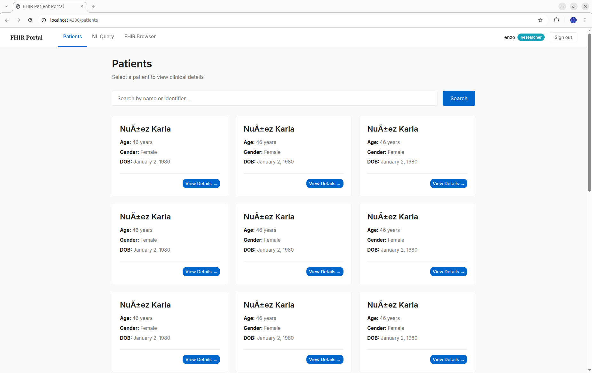
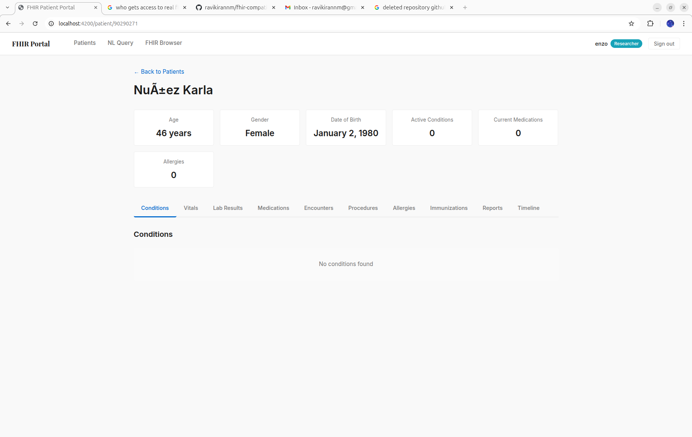
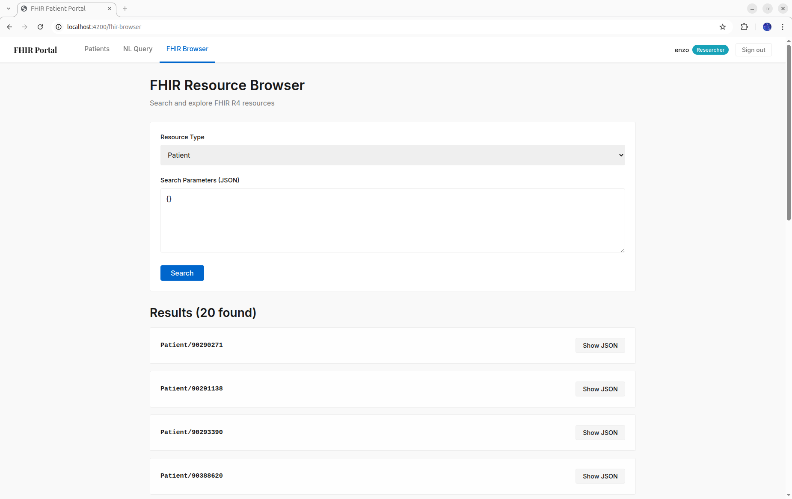

# FHIR Patient Portal

A clinical data exploration platform built on the **HL7 FHIR R4** standard. It provides a patient-centric clinical view, a developer-facing FHIR resource browser, and a natural-language query interface powered by a local LLM — all running on synthetic patient data with zero PHI risk.

---

## Screenshots

**Patient List** — Search and browse synthetic patients loaded from Synthea.



**Patient Detail** — Individual patient dashboard showing demographic summary cards and tabbed access to Conditions, Vitals, Lab Results, Medications, Encounters, Procedures, Allergies, Immunizations, Reports, and Timeline.



**Natural Language Query** — Type a clinical question in plain English; the LLM translates it to FHIR search parameters and executes the query transparently.


**FHIR Resource Browser** — Select any FHIR R4 resource type, supply JSON search parameters, and inspect raw results or full JSON payloads.



---

## What It Does

- **Patient dashboard** — unified view of encounters, conditions, medications, allergies, immunizations, observations, procedures, and diagnostic reports for any patient
- **NL → FHIR queries** — ask questions like *"show diabetic patients over 60 with active hypertension"*; the Qwen2.5:7b model translates them to validated FHIR search parameters
- **FHIR resource browser** — direct exploration of raw FHIR resources with JSON inspection and FHIR search parameter queries (researcher role only)
- **Visual analytics** — Chart.js for vital sign trends and lab trajectories; D3.js for a unified patient timeline across all resource types
- **Role-based access** — separate clinician and researcher roles enforced via JWT claims
- **Integration seams** — `/bundle` and `/medications` endpoints return FHIR-native payloads ready for downstream analyzer modules

---

## Architecture

```
User Browser (Angular, port 4200)
        │
        ▼
Flask API (port 5000)
        ├──▶ HAPI FHIR R4 (port 8080) ──▶ PostgreSQL
        ├──▶ Ollama / Qwen2.5:7b (port 11434)
        └──▶ SQLite  (auth / users)
```

### Frontend

| Concern | Library |
|---|---|
| Framework | Angular 21.2.0 (standalone components) |
| Styling | SCSS + Bootstrap 5.3.3 |
| Charts | Chart.js 4.x + ng2-charts |
| Timeline | D3.js 7.x |
| Markdown | marked 15.x + DOMPurify 3.x |
| Dates | date-fns 3.x |
| FHIR types | @types/fhir |

### Backend

| Concern | Library |
|---|---|
| Framework | Flask + flask-cors |
| Auth | flask-jwt-extended + bcrypt |
| FHIR models | fhir.resources (Pydantic-based) |
| LLM | ollama Python client |
| ORM | SQLAlchemy (SQLite) |
| Validation | Pydantic |

### Infrastructure

| Component | Technology |
|---|---|
| FHIR server | HAPI FHIR R4 (`hapiproject/hapi:latest`) |
| FHIR persistence | PostgreSQL 16 |
| LLM runtime | Ollama with Qwen2.5:7b |
| Synthetic data | Synthea |
| Orchestration | Docker Compose |

---

## FHIR Resources Supported

| Category | Resources |
|---|---|
| Clinical | Patient, Encounter, Observation, Condition, Procedure, AllergyIntolerance, Immunization |
| Medications | MedicationRequest, MedicationAdministration |
| Documentation | DiagnosticReport, DocumentReference |

---

## Project Structure

```
.
├── backend/
│   ├── engine/
│   │   ├── main.py                 # Flask app and routes
│   │   ├── auth.py                 # JWT auth and RBAC
│   │   ├── fhir_proxy.py           # HAPI FHIR REST client
│   │   ├── nl_query.py             # NL → FHIR translation
│   │   ├── prompt_templates.py     # Few-shot prompts for Qwen2.5
│   │   ├── validators.py           # FHIR search param validation
│   │   ├── resources/              # Per-resource endpoint modules
│   │   ├── database.py             # SQLite auth operations
│   │   └── data_model.py           # Pydantic models
│   ├── data/
│   │   └── load_synthea.py         # Synthea bulk loader
│   ├── run.py
│   ├── constants.py
│   └── requirements.txt
│
├── frontend/
│   └── src/app/
│       ├── components/
│       │   ├── patient-list/       # Patient search and list
│       │   ├── patient-detail/     # Patient clinical view
│       │   ├── resource-browser/   # FHIR resource explorer
│       │   ├── nl-query/           # Natural language query
│       │   ├── timeline/           # D3 patient timeline
│       │   ├── vital-chart/        # Vital sign charts
│       │   ├── lab-trends/         # Lab result trends
│       │   └── med-timeline/       # Medication timeline
│       └── services/
│           ├── api.service.ts
│           ├── auth.service.ts
│           └── fhir.service.ts
│
├── docker-compose.yml
└── README.md
```

---

## Running the Application

### Docker Compose (recommended)

```bash
docker-compose up
```

Starts HAPI FHIR on port 8080, PostgreSQL internally, Flask on port 5000, and Angular on port 4200. Ollama must be installed and running on the host.

**Load synthetic patients after containers are up:**

```bash
docker-compose exec backend python data/load_synthea.py --patients 100
```

### Manual Setup

**Prerequisites:**

```bash
ollama pull qwen2.5:7b   # LLM model
java --version            # Must be 17+ for Synthea
```

**Backend:**

```bash
cd backend
pip install -r requirements.txt
python run.py
```

**Frontend:**

```bash
cd frontend
npm install
npm start
```

**HAPI FHIR:**

```bash
docker run -p 8080:8080 hapiproject/hapi:latest
```

App is accessible at `http://localhost:4200`.

---

## Configuration

Create `backend/.env`:

```env
FLASK_SECRET_KEY=your-secret-key
JWT_SECRET_KEY=your-jwt-secret
FLASK_ENV=development

FHIR_BASE_URL=http://localhost:8080/fhir
FHIR_VERSION=R4

OLLAMA_URL=http://localhost:11434
OLLAMA_MODEL=qwen2.5:7b

SQLITE_PATH=./data/users.db
CORS_ORIGINS=http://localhost:4200
```

---

## API Reference

### Auth
- `POST /auth/login` — authenticate, returns JWT
- `POST /auth/register` — create user (admin only)
- `GET /auth/me` — current user and role

### Patients
- `GET /api/v1/patients` — paginated, searchable list
- `GET /api/v1/patients/{id}` — demographics
- `GET /api/v1/patients/{id}/bundle` — complete FHIR bundle
- `GET /api/v1/patients/{id}/summary` — aggregated clinical summary

### Clinical Resources (all scoped to a patient)
- `GET .../encounters` `conditions` `observations` `procedures` `allergies` `immunizations`
- `GET .../medications` `medication-admin`
- `GET .../diagnostic-reports` `documents`

### FHIR Browser
- `GET /api/v1/fhir/{resource_type}` — search by FHIR parameters
- `GET /api/v1/fhir/{resource_type}/{id}` — get by ID

### Natural Language Query
- `POST /api/v1/nl-query`
  ```json
  { "query": "show diabetic patients over 60", "execute": true }
  ```

### Integration Stubs (future modules)
- `POST /api/v1/analyze` — symptom pattern analyzer (returns 501)
- `POST /api/v1/check-interactions` — prescription interaction checker (returns 501)

---

## Synthetic Data

Patient data is generated by [Synthea](https://github.com/synthetichealth/synthea), which produces realistic clinical histories following real-world disease progression patterns. No PHI is used at any point.

```bash
java -jar synthea-with-dependencies.jar -p 100 -s 12345
# Outputs FHIR bundles to output/fhir/*.json
```

Pre-generated populations are also available from [SyntheticMass](https://synthea.mitre.org/downloads) for large-scale testing.
